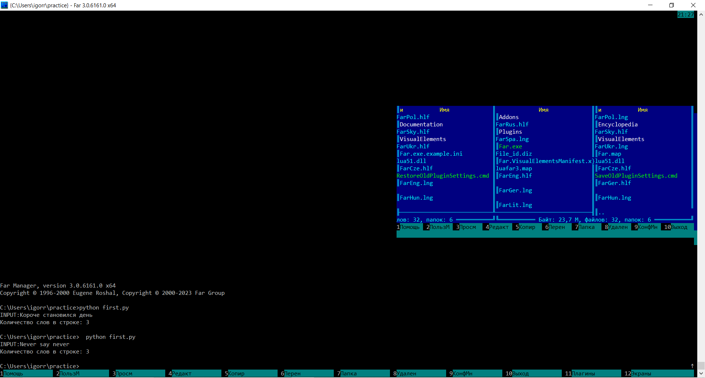
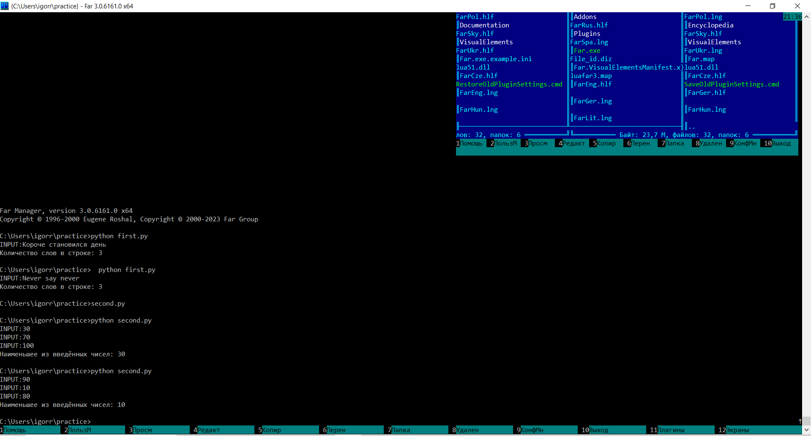

###__Файловый менеджер Far__

__1. Программа для подстчета количества слов в строке__
1.1 Код программы
```python
def number_of_words (n):
    word_count = 0
    if len(n) > 0 and n[0] != " ":
        word_count = 1
    for i in range(len(n)-1):
        if n[i] == " " and n[i + 1] != " ":
            word_count += 1
    return word_count

m = input("INPUT:")
print("Количество слов в строке:", number_of_words(m))
```
1.2 Скриншот вывода программы


***
__2. Программа для нахождения минимального из введенных чисел__
2.1 Код программы
```python
def minimum (n1, n2, n3):
    if n1 < n2 and n1 <n3:
        return n1
    elif n2 < n1 and n2 < n3:
        return n2
    elif n3 < n1 and n3 < n2:
        return n3

m1 = int(input("INPUT:"))
m2 = int(input("INPUT:"))
m3 = int(input("INPUT:"))
print("Наименьшее из введённых чисел:", minimum (m1, m2, m3))
```
2.2 Скриншот вывода программы

***

